# Explotación y Mitigación de Gestión Insegura de Sesiones
--- 
Tema: Secuestro de sesiones

Tenemos como **objetivo**:

> - Ver cómo se pueden hacer ataques en la gestión de las sesiones.
>
> - Analizar el código de la aplicación que permite ataques de Gestión insegura de sesiones.
>
> - Implementar diferentes modificaciones del codigo para aplicar mitigaciones o soluciones.

## ¿Qué es Session Management?
---
El Session Management (gestión de sesiones) es un mecanismo que permite a las aplicaciones web rastrear y mantener el estado de los usuarios a lo largo de múltiples solicitudes HTTP. Una mala implementación puede exponer la aplicación a ataques como Session Hijacking (secuestro de sesión) o reutilización de tokens para suplantación de identidad.

## ACTIVIDADES A REALIZAR
---
> Lee detenidamente la sección de autenticación de la página de PortWigger <https://portswigger.net/web-security/authentication#what-is-authentication>
>
> Lee el siguiente documento sobre Explotación y Mitigación de Gestión de sesiones inseguras <./files/ExplotacionMitigacionGestionInseguraSesiones.pdf>
> 
> También y como marco de referencia, tienes [ la sección de correspondiente de Gestión de Sesiones  del **Proyecto Web Security Testing Guide** (WSTG) del proyecto **OWASP**.](https://owasp.org/www-project-web-security-testing-guide/latest/4-Web_Application_Security_Testing/06-Session_Management_Testing/README)
>

Vamos realizando operaciones:

### Iniciar entorno de pruebas

-Situáte en la carpeta de del entorno de pruebas de nuestro servidor LAMP e inicia el esce>

~~~
docker-compose up -d
~~~

## Código vulnerable
---

Creamos el archivo vulnerable: **session.php**

~~~
<?php
session_start();

if (isset($_GET['user'])) {
    $_SESSION['user'] = $_GET['user'];
    echo "Sesión iniciada como: " . htmlspecialchars($_SESSION['user']);
}
?>

<!DOCTYPE html>
<html lang="es">
<head>
    <meta charset="UTF-8">
    <title>Inicio de Sesión Inseguro</title>
</head>
<body>
    <h2>Iniciar sesión</h2>
    <form method="GET">
        <label for="user">Usuario:</label>
        <input type="text" id="user" name="user" required>
        <button type="submit">Iniciar sesión</button>
    </form>
</body>
</html>
~~~

Se nos muestra una entrada de texto para que introduzcamos nuestro usuario:

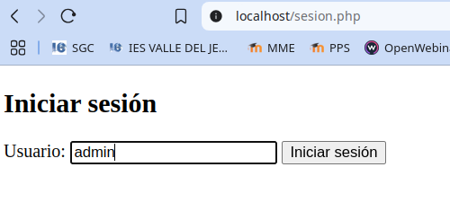

El formulario se envia como `http://localhost/sesion.php?user=admin` y con método get.

Nos informa que se ha iniciado sesión con el usuario introducido:

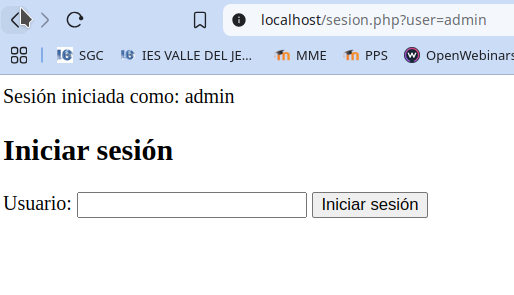

**¿Por qué es vulnerable?**

1. No se valida ni se sanea el parámetro user, permitiendo inyecciones.

2. No se regenera el identificador de sesión al iniciar sesión, permitiendo reutilización de sesiones.

3. No hay restricciones de seguridad en la cookie de sesión, facilitando ataques como Session Hijacking o Session Fixation.

4. La sesión puede ser manipulada fácilmente modificando la URL (por ejemplo: ?user=SuperAdmin) para acceder con cualquier usuario, incluso con usuarios privilegiados.

## Explotación de Session Hijacking
---

Si un atacante obtiene una cookie de sesión válida, puede suplantar a un usuario legítimo.

1. Capturar la cookie de sesión activa desde el navegador de la víctima.

2. Usar esa misma cookie en otro navegador o dispositivo.

3. Si la sesión es válida y reutilizable, la aplicación es vulnerable.

**Pasos para obtener las _"Coockies"_en el navegador**

🔍 Vamos a Ver como podemos ver el encabezado **Set-Cookie** para acceder a los datos de sesión.

- Abre tu página en Chrome donde se ejecuta tu código PHP.

- Presiona **F12** o haz clic derecho y selecciona **"Inspeccionar"** para abrir las herramientas de desarrollador.

- Ve a la pestaña **""Network"** (Red).

- Selecciona la pestaña **"all"**

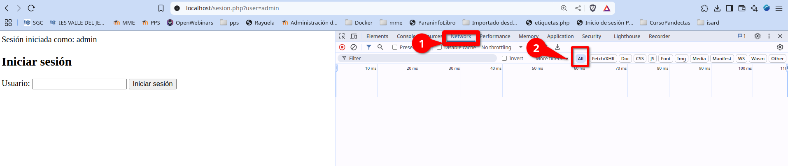

- Recarga la página (F5) con las herramientas abiertas.

- Busca en la lista de peticiones la que corresponda a tu archivo PHP (por ejemplo: **index.php, login.php, etc.**).

- Haz clic en esa petición.

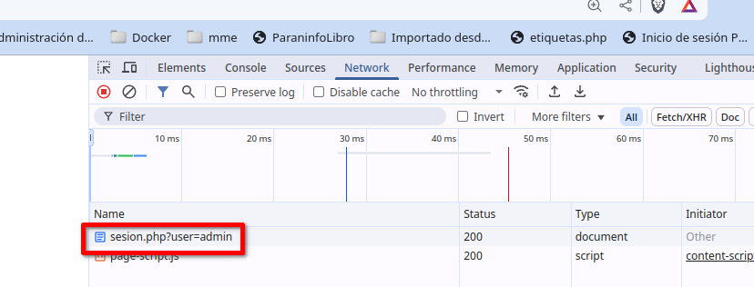

- Dentro del panel de detalles, selecciona la subpestaña **"Headers"** (Encabezados).

- Baja hasta la sección **"Response Headers"** (Encabezados de respuesta).

Ahí deberías ver una línea como: `Cookie` y dentro de ella una variable `PHPSESID` con su valor: `PHPSESSID=abc123xyz456`

También tenemos justamente debajo el servidor dónde se ha almacenado `host   localhost`

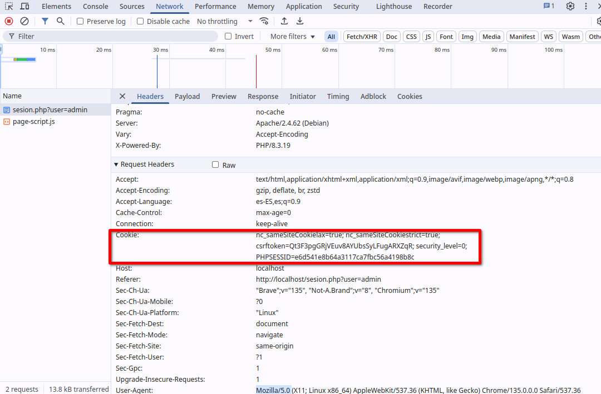

**Ataque detallado: Session Hijacking**

A continuación, se detalla cómo un atacante puede explotar este código vulnerable para secuestrar la sesión de unusuario legítimo.

1. El usuario legítimo inicia sesión

	1. El usuario accede a la web y pasa su nombre de usuario en la URL: 

	~~~
	http://localhost/session.php?user=admin
	~~~

	2. El servidor crea una sesión y almacena la variable: `$_SESSION['user'] = 'admin';`

	3. El navegador almacena la cookie de session: `Cookie: PHPSESSID=e6d541e8b64a3117ca7fbc56a4198b8c; path=/;`

	4. Ahora, cada vez que el usuario haga una solicitud, el navegador enviará la cookie: `Cookie: PHPSESSID=e6d541e8b64a3117ca7fbc56a4198b8c`

2.  El atacante roba la cookie de sesión
	
	El atacante necesita obtener el Session ID (PHPSESSID) de la víctima. Puede hacerlo de varias formas:

> **Robar Cookie mediante Captura de tráfico (MITM)**
>
> Si la web no usa HTTPS, un atacante puede capturar paquetes de red con herramientas como Wireshark:
>
>1. Iniciar Wireshark y
> ~~~
> sudo wireshak 
>~~~
>
>Se nos pide introducir una interfaz de red para capturar el tráfico. Como nosotros estamos virtuaizando, es posible que tengamos muchas, pero vamos a ver la actividad en las diferentes redes.
>
>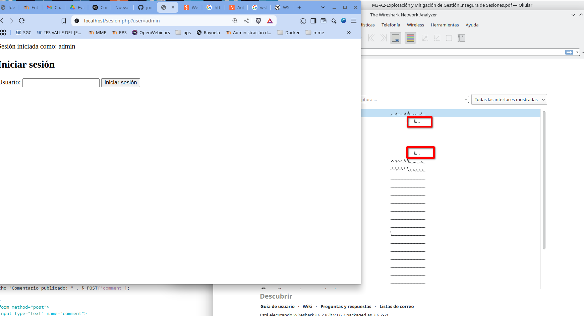
>
> En este momento puede enviar mi consulta a `http://localhost/session.php` y veré en que red se produce la actividad y la selecciono.
>
>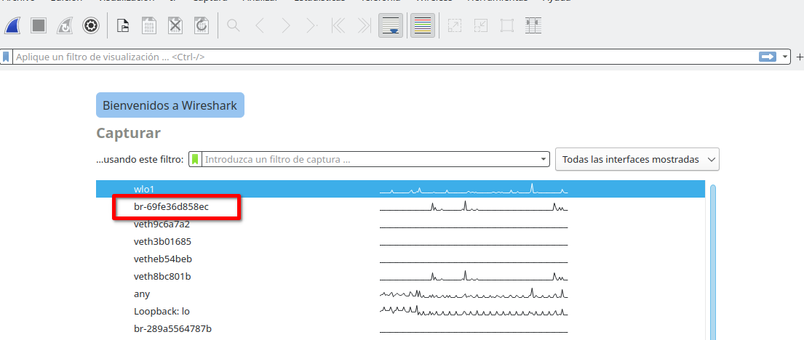
>
> Una vez que  estamos capturando el tráfico de la red, en filtro, ponemos `http.cookie` y nos mostrará el inmtercambio de paquetes donde tenemos esos datos.
>
>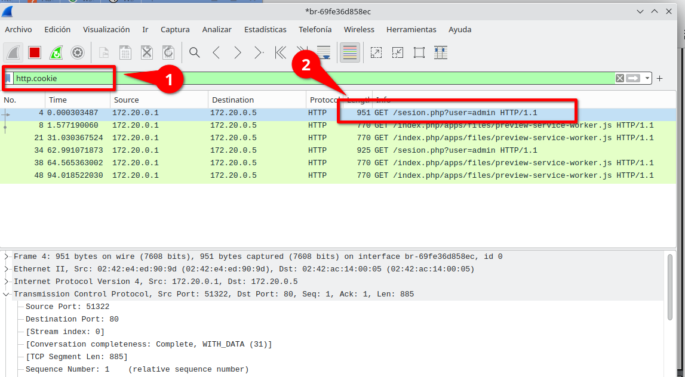
>
> Hacemos doble click sobre ese paquete y se nos abre una ventana con todos los datos. 
>
>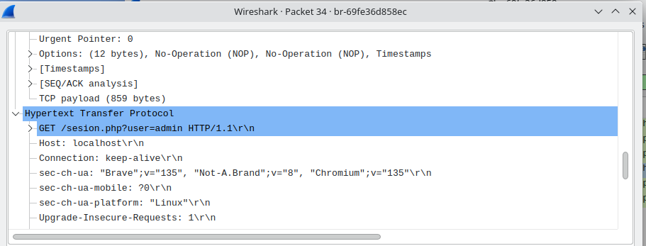
>
> Nos vamos al apartado **Hypertext Transfer Protocol**  y allí podemos ver la información de las variables.
>
>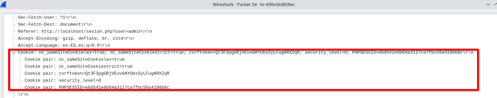
>
>Ya el atacante tiene los datos de nuestra sesión.

> **Robar Cookie mediante Ataque XSS (Cross-Site Scripting)**
>Si la aplicación tiene alguna vulnerabilidad XSS, el atacante puede inyectar un script para robar cookies. 
>
> Puedes ver cómo obtener los datos de sesión mediante ataque XSS en la actividad correspondiente: <https://github.com/jmmedinac03vjp/PPS-Unidad3Actividad5-XSS>

> **Robar Cookie mediante Sniffing en redes WiFi públicas**
>
> Si la víctima usa una WiFi pública sin HTTPS, su cookie puede ser interceptada con herramientas como Firesheep o Ettercap.
>
>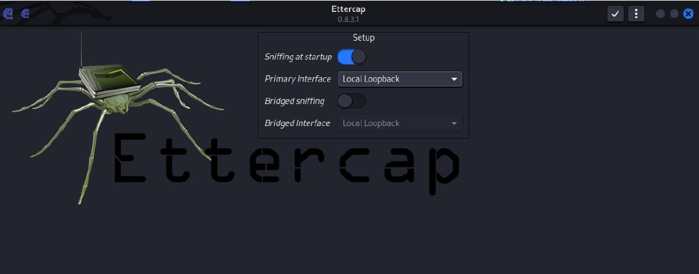
>

**Como utilizar la cookie robada**

Una vez que el atacante tiene la cookie de sesión (PHPSESSID=e6d541e8b64a3117ca7fbc56a4198b8c), la puede utilizar para suplantar a la víctima.

1. Editar cookies en el navegador: Abrir las herramientas de desarrollador (F12 en Chrome).

2. Ir a Application > Storage > Cookies.

3. Seleccionar https://localhost

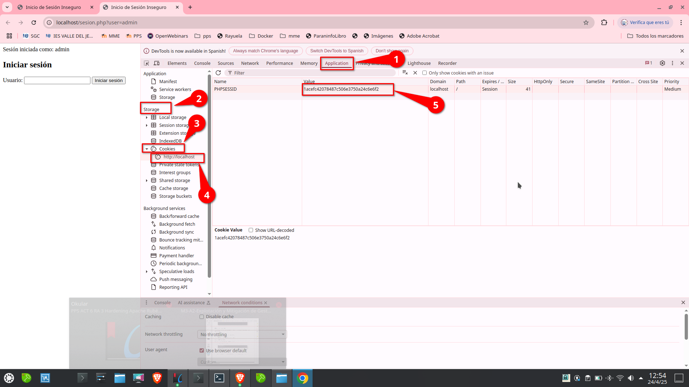

4. Modificar PHPSESSID y reemplazarlo por el valor robado.

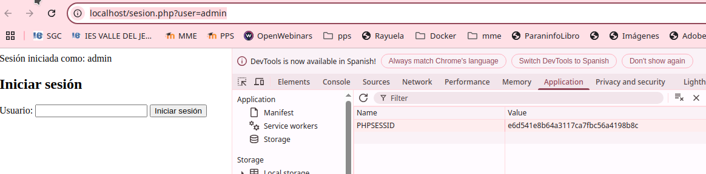

5. Enviar el Session ID en una solicitud.

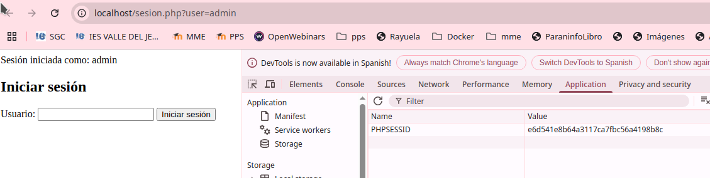

El atacante puede acceder directamente a la sesión de la víctima: http://localhost/session.php

Añadiendo manualmente la cookie con cURL:

~~~
curl -b "PHPSESSID=e6d541e8b64a3117ca7fbc56a4198b8c" https://localhost/sesion.php
~~~

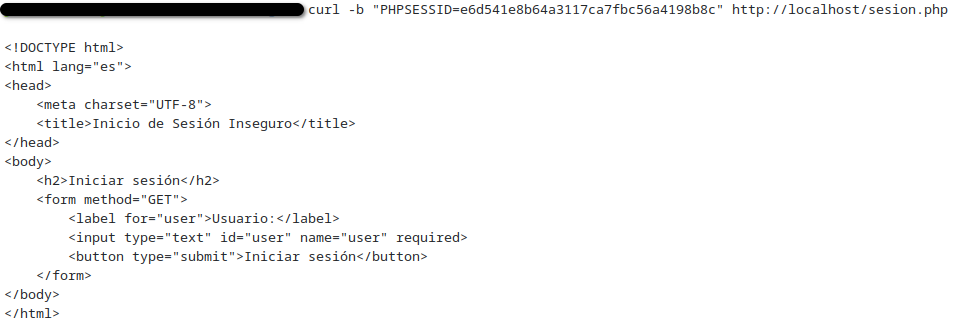

6. Acceso a la cuenta de la víctima

Ahora el atacante ya puede:

- Ver datos personales de la víctima.

- Realizar cambios en la cuenta (si hay opciones de perfil).

- Hacer compras o transacciones (si la web lo permite).

- Modificar la contraseña del usuario.

## Mitigación de Session Hijacking
---

Para evitar este ataque, hemos implementado varias medidas (las vemos una a una, tienes el código completo al final de la explicación de todas ellas):

**Regenerar el ID de sesión en cada inicio de sesión, además guarda en la sesión el valor recibido por `GET['user']`, sanitizándolo para evitar ataques XSS (Cross-Site Scripting).**

~~~
session_start();
session_regenerate_id(true); // Borra la sesión anterior y genera una nueva
$_SESSION['user'] = htmlspecialchars($_GET['user'], ENT_QUOTES, 'UTF-8');
~~~

Veremos como cada vez que accedamos a la sesión nos generara un valor nuevo de PHPSESSID.

**Configurar la cookie de sesión de forma segura**

Al introducir los siguientes cambios prevenimos accesos de sesión desde la url y desde JavaScript

~~~
ini_set('session.cookie_secure', 1);
 // Solo permite cookies en HTTPS
ini_set('session.cookie_httponly', 1); // Evita acceso desde JavaScript (prevención XSS)
ini_set('session.use_only_cookies', 1); // Impide sesiones en URL
~~~

**Validar la IP y User-Agent del usuario**

~~~
session_start();
if (!isset($_SESSION['ip'])) {
	$_SESSION['ip'] = $_SERVER['REMOTE_ADDR'];
}
if ($_SESSION['ip'] !== $_SERVER['REMOTE_ADDR']) {
	session_destroy();
	header("Location: login.php");
	exit();
}
~~~

**Implementar tiempo de expiración de sesión**

~~~
ini_set('session.gc_maxlifetime', 1800); // Expira en 30 minutos
session_set_cookie_params(1800);
~~~

De esta forma la sesión sólo permanece abierta un tiempo determinado.

**Usar HTTPS siempre**

Configurar un SSL/TLS para cifrar las cookies y evitar capturas MITM.

~~~
// Redirigir HTTP a HTTPS si el usuario accede por HTTP
if (!isset($_SERVER['HTTPS']) || $_SERVER['HTTPS'] !== 'on') {
	header("Location: https://" . $_SERVER['HTTP_HOST'] . $_SERVER['REQUEST_URI']);
exit();
}
~~~

### Código seguro.

Creamos el archivo sesion1.php con el siguiente contenido:

~~~
<?php

// Configurar la seguridad de la sesión antes de iniciarla
ini_set('session.cookie_secure', 1);

 // Solo permite cookies en HTTPS
ini_set('session.cookie_httponly', 1); // Evita acceso desde JavaScript (prevención XSS)
ini_set('session.use_only_cookies', 1); // Impide sesiones en URL
ini_set('session.gc_maxlifetime', 1800); // Expira en 30 minutos
session_set_cookie_params(1800); // Configura el tiempo de vida de la cookie de sesión

// Redirigir HTTP a HTTPS si el usuario accede por HTTP
if (!isset($_SERVER['HTTPS']) || $_SERVER['HTTPS'] !== 'on') {
        header("Location: https://" . $_SERVER['HTTP_HOST'] . $_SERVER['REQUEST_URI']);
        exit();
}

session_start();
session_regenerate_id(true); // Borra la sesión anterior y genera una nueva

// Validación de IP para evitar Session Hijacking
if (!isset($_SESSION['ip'])) {
        $_SESSION['ip'] = $_SERVER['REMOTE_ADDR']; // Guarda la IP al iniciar sesión
} elseif ($_SESSION['ip'] !== $_SERVER['REMOTE_ADDR']) {
        session_destroy(); // Destruir la sesión si la IP cambia
        header("Location: login.php");
        exit();
}

// Verificar tiempo de inactividad para expirar la sesión
if (!isset($_SESSION['last_activity'])) {
        $_SESSION['last_activity'] = time(); // Registrar el primer acceso
} elseif (time() - $_SESSION['last_activity'] > 1800) { // 30 minutos
        session_unset(); // Eliminar variables de sesión
        session_destroy(); // Destruir la sesión
        header("Location: login.php");
        exit();
} else {
        $_SESSION['last_activity'] = time(); // Reiniciar el temporizador
}

// Protección contra XSS en el usuario
if (!isset($_SESSION['user'])) {
        if (isset($_GET['user'])) {
                $_SESSION['user'] = htmlspecialchars($_GET['user'], ENT_QUOTES, 'UTF-8');
        } else {
                $_SESSION['user'] = "Desconocido"; // Evita variable indefinida
        }
}
// Mostrar la sesión activa
echo "Sesión iniciada como: " . $_SESSION['user'];

?>

<!DOCTYPE html>
<html lang="es">
<head>
    <meta charset="UTF-8">
    <title>Inicio de Sesión Inseguro</title>
</head>
<body>
    <h2>Iniciar sesión</h2>
    <form method="GET">
        <label for="user">Usuario:</label>
        <input type="text" id="user" name="user" required>
        <button type="submit">Iniciar sesión</button>
    </form>
</body>
</html>

~~~

### Cómo habilitar HTTPS con SSL/TLS en Localhost (Apache)
---

Para proteger la sesión y evitar ataques Man-in-the-Middle (MITM), es crucial habilitar HTTPS en el servidor local. Veamos cómo podemos habilitarlo en Apache con dos métodos diferentes.

**Método 1: Habilitar HTTPS en Apache con OpenSSL**

1. Generamos un certificado SSL autofirmado

Para entornos de prueba o desarrollo, se puede utilizar un **certificado autofirmado**, es decir, un certificado que no ha sido emitido por una entidad de certificación.

#### Paso 1: Crear la clave privada y el certificado
---

Como estamos trabajando bajo docker, accedemos al servidor:

~~~
docker exec -it lamp-php83 /bin/bash
~~~

comprobamos que están creados los directorios donde se guardan los certificados y creamos el certificado autofirmado:

~~~
mkdir /etc/apache2/ssl
cd /etc/apache2/ssl
openssl req -x509 -nodes -days 365 -newkey rsa:2048 -keyout localhost.key -out localhost.crt
~~~

**Explicación de los parámetros del comando:**

- `req`: inicia la generación de una solicitud de certificado.
- `-x509`: crea un certificado autofirmado en lugar de una CSR.
- `-nodes`: omite el cifrado de la clave privada, evitando el uso de contraseña.
- `-newkey rsa:2048`: genera una nueva clave RSA de 2048 bits.
- `-keyout server.key`: nombre del archivo que contendrá la clave privada.
- `-out server.crt`: nombre del archivo de salida para el certificado.
- `-days 365`: el certificado será válido por 365 días.

Durante la ejecución del comando, se te solicitará que completes datos como país, nombre de organización, y nombre común (dominio).

Vemos como se han creado el certificado y la clave pública
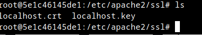

### Paso 2.Configurar Apache para usar HTTPS

Una vez que tengas el certificado y la clave privada, debes configurar Apache para utilizarlos.

Edita el archivo de configuración SSL, por ejemplo:
~~~
cd /etc/apache2/sites-available 
// Hacemos copia de seguridad de archivo de configuracion  ssl 

cp default-ssl.conf default-ssl.conf.old

// modificamos archivos de configuracion
nano default-ssl.conf
~~~

Introducimos el siguiente contenido en el archivo de configuración:

~~~
<VirtualHost *:443>
    ServerName www.pps.edu

    SSLEngine on
    SSLCertificateFile /etc/ssl/certs/server.crt
    SSLCertificateKeyFile /etc/ssl/private/server.key

    DocumentRoot /var/www/html
</VirtualHost>

~~~
Date cuenta que hemos creado un **servidor virtual** con nombre **www.pps.edu**. A partir de ahora tendremos que introducir en la barra de dirección del navegador `https://www.pps.edu` en vez de `https://localhost`.

### Paso3: Luego habilita SSL y el sitio:

~~~
a2enmod ssl
a2ensite default-ssl.conf
service apache2 reload
~~~

### Paso 4: poner dirección en /etc/hosts o habilitar puerto 443

Editar el archivo de configuración de Apache `default-ssl.conf`:

~~
sudo nano /etc/apache2/sites-available/default-ssl.conf
~~

Modificar o añadir estas líneas dentro:
~~~
<VirtualHost *:443>
ServerAdmin webmaster@localhost
ServerName localhost
DocumentRoot /var/www/html
SSLEngine on
SSLCertificateFile /etc/apache2/ssl/localhost.crt
SSLCertificateKeyFile /etc/apache2/ssl/localhost.key
<Directory /var/www/html>
AllowOverride All
Require all granted
</Directory>
</VirtualHost>
~~~

### Paso 5: Habilitar el módulo SSL en Apache
En el servidor Apache, activamos **SSL** mediante la habilitación de la configuración `default-ssl.conf`que hemos creado:

~~~
a2enmod default-ssl
a2ensite default-ssl
service apache2 reload
~~~

Ahora el servidor soportaría **HTTPS**. Accedemos al servidor en la siguiente dirección: `https://localhost/`

### 🔒 Forzar HTTPS en Apache2 (default.conf y .htaccess)

Podemos hacer que todas las solicitudes HTTP sean forzadas a HTTPS. 

Para que todas las conexiones se realicen por HTTPS po hacerlo de varias formas:

Tienes dos opciones:
	1. Configuración en default.conf (archivo de configuración de Apache)

Edita tu archivo de configuración del sitio (por ejemplo /etc/apache2/sites-available/000-default.conf).

a) Usar Redirect directo
~~~
<VirtualHost *:80>
    ServerName midominio.com
    ServerAlias www.midominio.com

    Redirect permanent / https://midominio.com/
</VirtualHost>

<VirtualHost *:443>
    ServerName midominio.com
    DocumentRoot /var/www/html

    SSLEngine on
    SSLCertificateFile /ruta/al/certificado.crt
    SSLCertificateKeyFile /ruta/a/la/clave.key
    SSLCertificateChainFile /ruta/a/la/cadena.crt

    # Configuración adicional para HTTPS
</VirtualHost>

b) Usar RewriteEngine para mayor flexibilidad

<VirtualHost *:80>
    ServerName midominio.com
    ServerAlias www.midominio.com

    RewriteEngine On
    RewriteCond %{HTTPS} off
    RewriteRule ^ https://%{HTTP_HOST}%{REQUEST_URI} [L,R=301]
</VirtualHost>

2. Configuración en .htaccess

Si prefieres hacerlo desde un .htaccess en la raíz del proyecto:

RewriteEngine On

# Si no está usando HTTPS

RewriteCond %{HTTPS} !=on
RewriteRule ^ https://%{HTTP_HOST}%{REQUEST_URI} [L,R=301]

🔥 Recuerda: Para que .htaccess funcione correctamente, en tu default.conf debes tener habilitado AllowOverride All:

<Directory /var/www/html>
    AllowOverride All
</Directory>

También asegúrate que el módulo mod_rewrite esté habilitado:

sudo a2enmod rewrite
sudo systemctl reload apache2

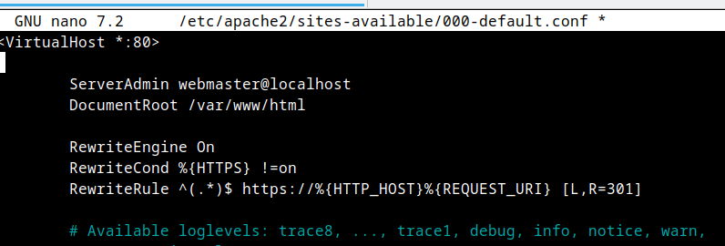

Verificar que HTTPS funciona correctamente
1o Acceder a https://localhost/ en el navegador.
2o Aceptar el certificado autofirmado (en Chrome, haz clic en Avanzado → Proceder).
3o Verificar que las cookies de sesión ahora tienen Secure activado:
•

•
•
Abrir DevTools (F12 en Chrome o Firefox).
Ir a Application → Storage → Cookies → localhost.
Comprobar que la cookie de sesión tiene el flag Secure habilitado.
Código completo
<?php
// Configurar la seguridad de la sesión antes de iniciarla
ini_set('session.cookie_secure', 1);
 // Solo permite cookies en HTTPS
ini_set('session.cookie_httponly', 1); // Evita acceso desde JavaScript (prevención XSS)
ini_set('session.use_only_cookies', 1); // Impide sesiones en URL
ini_set('session.gc_maxlifetime', 1800); // Expira en 30 minutos
session_set_cookie_params(1800); // Configura el tiempo de vida de la cookie de sesión
// Redirigir HTTP a HTTPS si el usuario accede por HTTP
if (!isset($_SERVER['HTTPS']) || $_SERVER['HTTPS'] !== 'on') {
header("Location: https://" . $_SERVER['HTTP_HOST'] . $_SERVER['REQUEST_URI']);
exit();
}
session_start();
session_regenerate_id(true); // Borra la sesión anterior y genera una nueva
// Validación de IP para evitar Session Hijacking
if (!isset($_SESSION['ip'])) {
$_SESSION['ip'] = $_SERVER['REMOTE_ADDR']; // Guarda la IP al iniciar sesión
} elseif ($_SESSION['ip'] !== $_SERVER['REMOTE_ADDR']) {
session_destroy(); // Destruir la sesión si la IP cambia
header("Location: login.php");
exit();
}
// Verificar tiempo de inactividad para expirar la sesión
if (!isset($_SESSION['last_activity'])) {
$_SESSION['last_activity'] = time(); // Registrar el primer acceso
} elseif (time() - $_SESSION['last_activity'] > 1800) { // 30 minutos
session_unset(); // Eliminar variables de sesión
session_destroy(); // Destruir la sesión
header("Location: login.php");
exit();
} else {
$_SESSION['last_activity'] = time(); // Reiniciar el temporizador
}
// Protección contra XSS en el usuario
if (!isset($_SESSION['user'])) {
10
}
if (isset($_GET['user'])) {
$_SESSION['user'] = htmlspecialchars($_GET['user'], ENT_QUOTES, 'UTF-8');
} else {
$_SESSION['user'] = "Desconocido"; // Evita variable indefinida
}
// Mostrar la sesión activa
echo "Sesión iniciada como: " . $_SESSION['user'];
?>
* Resumen de las medidas de seguridad implementadas
Seguridad en sesiones:
o Cookies seguras (HTTPS, HttpOnly, Only Cookies)
o Regeneración de sesión
o Validación de IP
o Expiración por inactividad
Protección contra ataques:
o Prevención de XSS con htmlspecialchars()
o Protección contra secuestro de sesión (Session Hijacking)
o Redirección a HTTPS para evitar ataques MITM
Este código refuerza la seguridad de sesiones en PHP y es una buena práctica para aplicaciones web que
manejen autenticación de usuarios.
11

### **Código seguro**
---

Aquí está el código securizado:

🔒 Medidas de seguridad implementadas

- :

        - 

        - 

🚀 Resultado

✔ 

✔ 

✔ 

## ENTREGA

> __Realiza las operaciones indicadas__

> __Crea un repositorio  con nombre PPS-Unidad3Actividad6-Tu-Nombre donde documentes la realización de ellos.__

> No te olvides de documentarlo convenientemente con explicaciones, capturas de pantalla, etc.

> __Sube a la plataforma, tanto el repositorio comprimido como la dirección https a tu repositorio de Github.__

